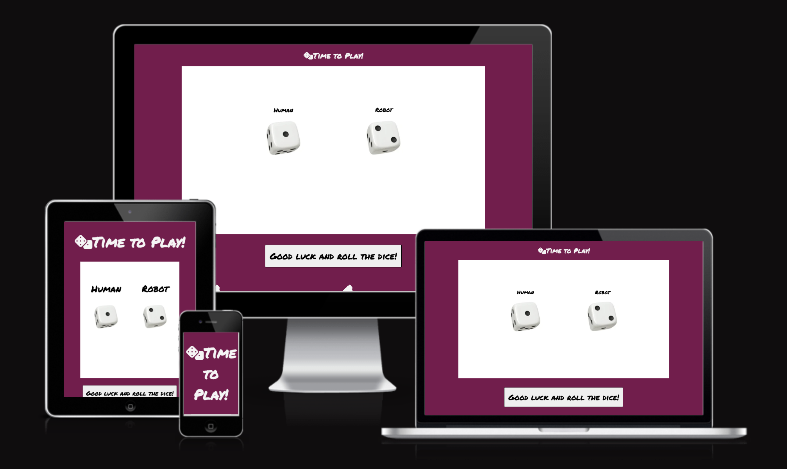
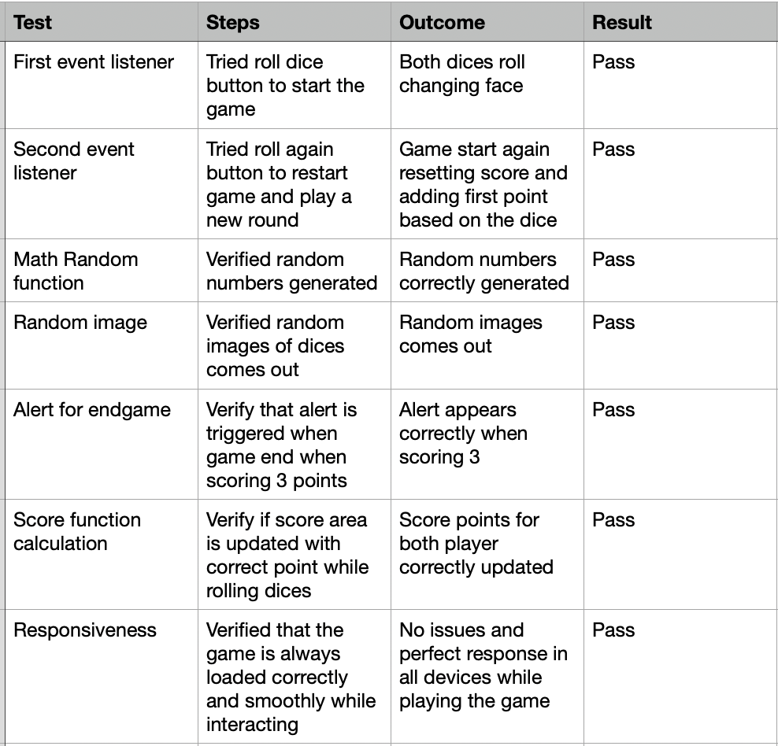
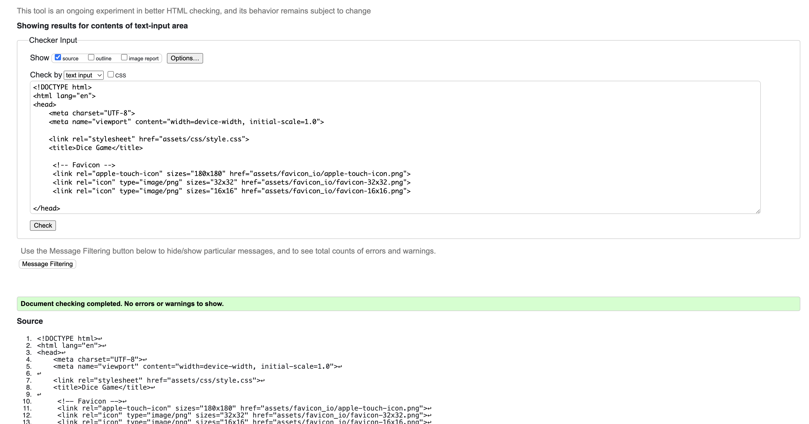
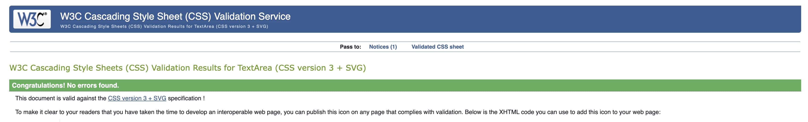
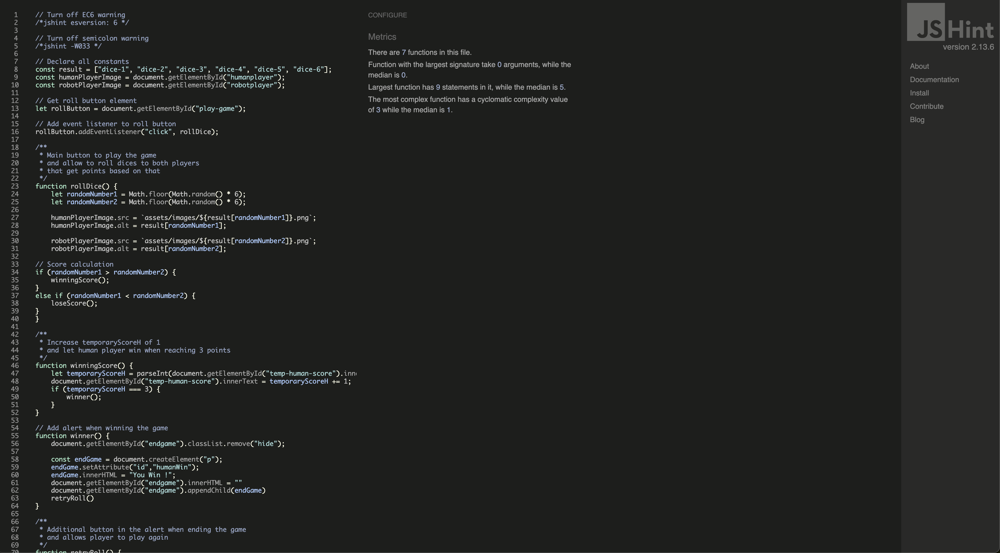
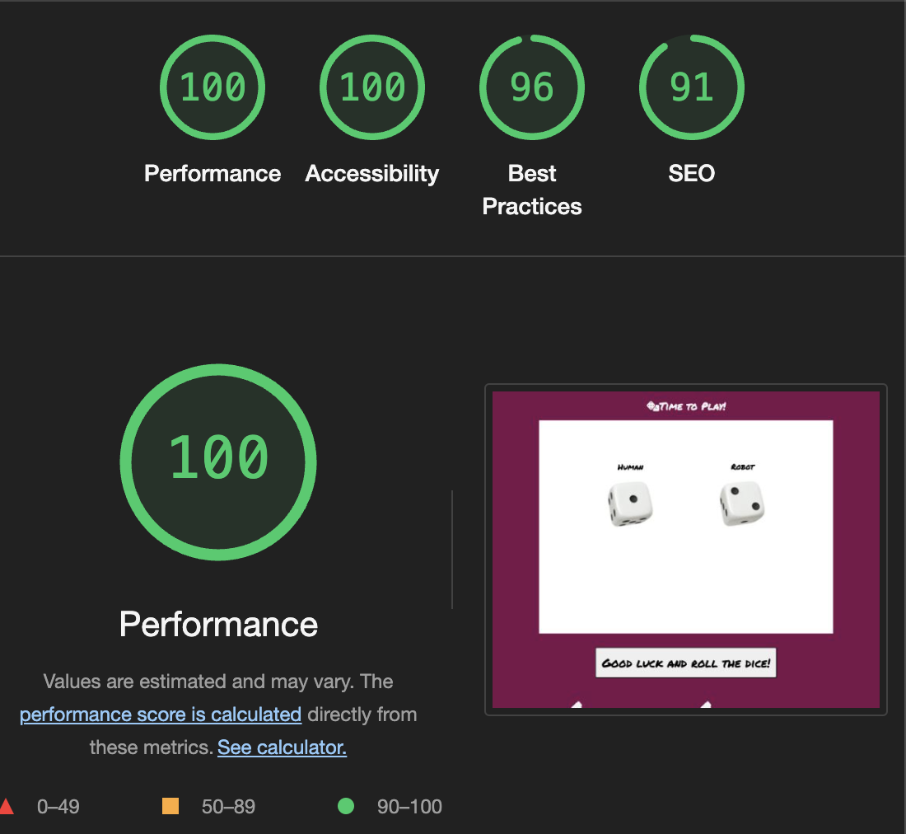

# Dice Game

Live project is available here https://ale-dp.github.io/dice-game/

In this project you can enjoy a classic dice game, with 2 players where you have a button to roll the dice and try to beat robot player with an higher number.
Equal numbers do not assign any point, so you keep rolling until you score 3.
Once one of the 2 player win the match reaching 3 point, an alert appears with a button to roll again and restart the game.

# Features

- Due to the simplicity of the game and the single page I used a unique and nice general Permanent Marker font .

# Media

- Icons are taken from https://fontawesome.com/
- Dices images are taken from https://www.shutterstock.com/
thanks to https://www.shutterstock.com/it/image-vector/white-3d-cube-casino-board-games-2379604319

# Technologies 

- Google Fonts was used to import the "Permanent Marker" font into the style.css file which is used as main and unique font. 

- Font Awesome: was used to add the icon for aesthetic purposes on the title.

- Git: was used for version control by utilising the Gitpod terminal to commit to Git and Push to GitHub.

-GitHub: is used as the respository for the projects code after being pushed from Git.

# Languages Used

-HTML5

-CSS3

# Testing

-Checked code on https://beautifier.io/ and https://prettier.io/

- Validator Testing : 

[HTML Validator link](https://validator.w3.org/)

[CSS Validator link](https://jigsaw.w3.org/css-validator/)

[JS Validator link](https://jshint.com/)

- Testing has been carried out on the following browsers :
    - Chrome Version 126.0.6478.127 (Official Build) (arm64)
    - Firefox Version 126.0.1 (64 bit)
    - Safari on macOS Sonoma 14.5 (Safari Version 17.5)

- Lighthouse Audits performed from Google Chrome inspector:

# Deployment
- How this site was deployed

In the GitHub repository, navigate to the Settings tab, then choose Pages from the left hand menu

From the source section drop-down menu, select the Master Branch

Once the master branch has been selected, the page will be automatically refreshed with a detailed ribbon display to indicate the successful deployment

Any changes pushed to the master branch will take effect on the live project

# How to clone the repository

- Go to the https://github.com/Ale-DP/dice-game/deployments/github-pages repository on GitHub
- Click the "Code" button to the right of the screen, click HTTPs and copy the link there
- Open a GitBash terminal and navigate to the directory where you want to locate the clone
- On the command line, type "git clone" then paste in the copied url and press the Enter key to begin the clone process
